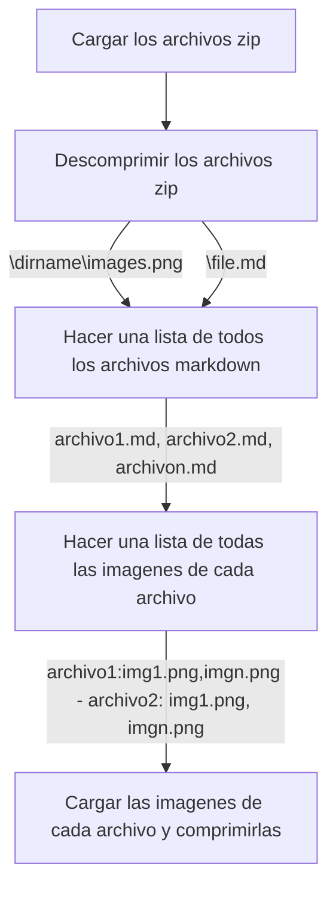

```mermaid
graph TD;
    Lo[Cargar los archivos zip];
    UZ[Descomprimir los archivos zip];
    Lmd[Hacer una lista de todos los archivos markdown];
    Limgs[Hacer una lista de todas las imagenes de cada archivo];
    Pimgs[Cargar las imagenes de cada archivo y comprimirlas]


    Lo-->UZ
    UZ --\dirname\images.png--> Lmd
    UZ --\file.md--> Lmd
    Lmd --archivo1.md, archivo2.md, archivon.md--> Limgs
    Limgs --archivo1:img1.png,imgn.png - archivo2: img1.png, imgn.png--> Pimgs
```